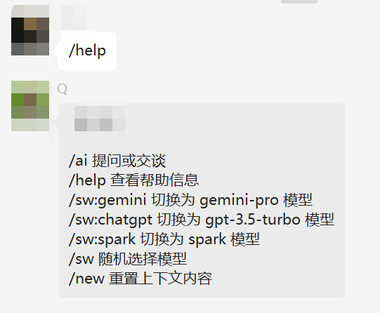

#### [号卡中心-专注优质号卡套餐服务](https://hk.bjjii.com/?p=ookk)
<a href="https://hk.bjjii.com/?p=ookk">
</a>


# Wechat Bot

一个 基于 AI 智能回复、支持上下文回复的微信机器人,可以用来帮助你自动回复微信消息。

### 快速开始

1. 下载并安装 [WeChatSetup-3.9.2.23](https://github.com/tom-snow/wechat-windows-versions/releases/download/v3.9.2.23/WeChatSetup-3.9.2.23.exe) 和 [wxbot.exe](https://github.com/x-dr/wechat-bot/releases)
> (wxbot.exe可能会报毒，信任即可;或者你可手动运行或编译)

2. 下载并修改 [config.yaml](https://raw.githubusercontent.com/x-dr/wechat-bot/main/config.yaml) 配置机器人参数

3. 双击 wxbot.exe 将自动启动微信和接口服务，扫码登录(wxbot.exe可能会报毒，信任即可)


### 手动运行、编译

1. 克隆本项目

2. 下载python

3. 安装依赖
```
pip install -r requirements.txt
```
4. 运行
```
python main.py
```
5. 编译成exe(可选)
```
pyinstaller wxbot.spec
```


# 使用

 

> 机器人体验


### 感谢

[@lich0821](https://github.com/lich0821/WeChatFerry)